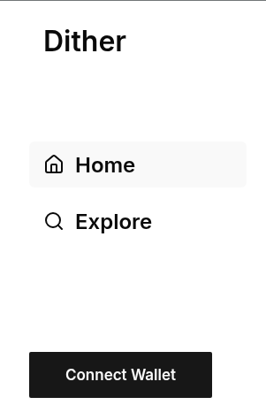
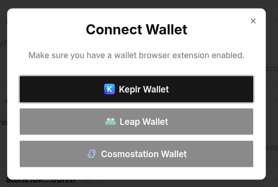
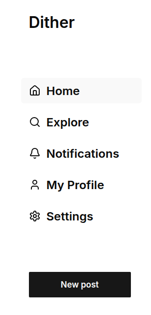
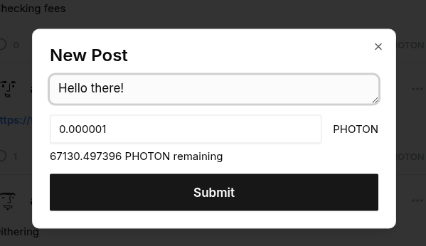

!!! Hey Listen!
We will never ask you for your private keys, or mnemonic phrase.
Never share this information with anyone else.
!!!

# Usage

Dither is a blockchain first application, meaning you will need an extension such as [Keplr](https://www.keplr.app) to post to the website directly. However, there are alternative ways to post to the protocol in an offline way.

## What _YOU_ need

1. AtomOne Address / Cosmos Account
2. PHOTON tokens on AtomOne

## Install Keplr

Below are the official links to the Keplr extension for Cosmos based chains.

- [Chrome Store](https://chrome.google.com/webstore/detail/keplr/dmkamcknogkgcdfhhbddcghachkejeap?hl=en)
- [Firefox](https://addons.mozilla.org/en-US/firefox/addon/keplr/)
- [Edge](https://microsoftedge.microsoft.com/addons/detail/keplr/ocodgmmffbkkeecmadcijjhkmeohinei)

## Connect to Dither

Dither uses your account address associated with the AtomOne chain to post.

**This means you will also need PHOTON to post to the chain.**

You can [obtain PHOTON on Osmosis](https://app.osmosis.zone/assets/PHOTON).

Alternatively, you can [Mint Photon if you have ATONE](https://cogwheel.zone/blog/how-to-mint-photon).

To connect your wallet click on `Connect Wallet` or the `Wallet Icon`.

## Select a Wallet

Select a wallet such as Keplr, Leap, or Cosmostation

## Sign a Message

You will be prompted to sign a message.

This message is used as an identifier to pull notifications from our database.

## Post!

Once you are signed in you will be able to post!

